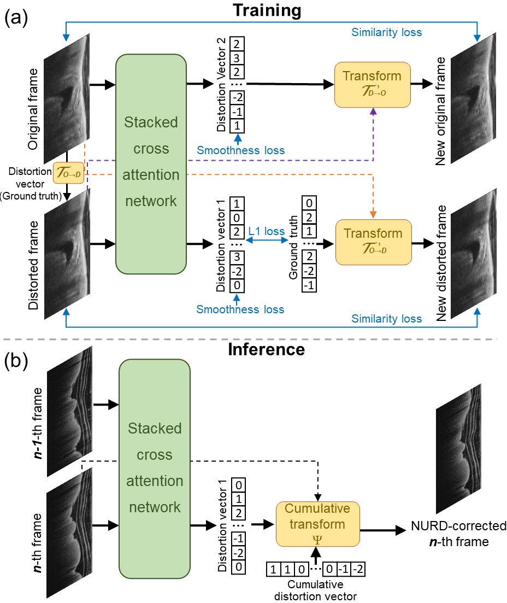
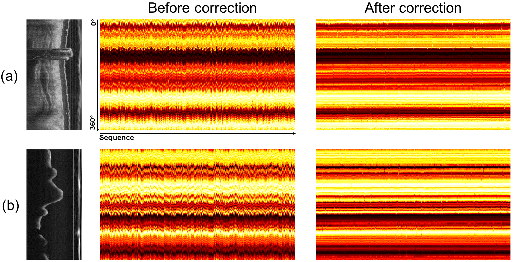
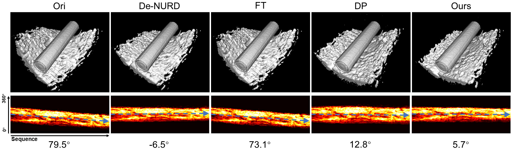

# Cross-attention-learning-enables-real-time-nonuniform-rotational-distortion-correction-in-OCT

This repository contains the code for the paper "Cross-attention learning enables real-time nonuniform rotational distortion correction in OCT". Here we provide the code for Details of implementation. Our approach achieves a substantial ∼3× speedup to real-time processing (26 ± 3 frames per second) and superior NURD correction performance. We hope this approach will contribute to the further development of endoscopic OCT technology and its multi-organ, multi-functional, multi-clinical scenario applications, as well as other rotational scanning imaging techniques such as intravascular ultrasound.





## Dependencies 
python==3.8<br>
torch==1.11.1<br>
numpy==1.19.5<br>
monai==0.7.0<br>
timm==0.3.2<br>
tensorboardX==2.1<br>
torchvision==0.12.0<br>
opencv-python==4.5.5<br>

## Usage
1. Clone the repository：
```
git clone https://github.com/SJTU-Intelligent-Optics-Lab/Cross-attention-learning-enables-real-time-nonuniform-rotational-distortion-correction-in-OCT.git
```  

2. Install the required dependencies:
```
pip install -r requirements.txt
```

3. Edit suitable path and parameters in main.py

4. Go to the corresponding folder and run:
```
cd Cross-attention-learning-enables-real-time-nonuniform-rotational-distortion-correction-in-OCT
```

5. In the training phase, the prepared architecture of the training dataset is referenced to `./dataset/training data/` folder. The name index of images and distortion vector as ground-truth are listed in `train.txt` and `val.txt`. Run the code:
```
python main.py --test_mode False --label True
```

6. In the test phase, the prepared architecture of the test sequence with NURD is referenced to `./dataset/test sequence/` folder. Run the code:
```
python main.py --test_mode True --label False
```
  After correction, the corrected sequence will be saved in folder  `./dataset/correction/` folder.


## Citation
```
@article{
  title={Cross-attention learning enables real-time nonuniform rotational distortion correction in OCT},
  author={HAORAN ZHANG, JIANLONG YANG,* JINGQIAN ZHANG, SHIQING ZHAO, and AILI ZHANG},
}
```
